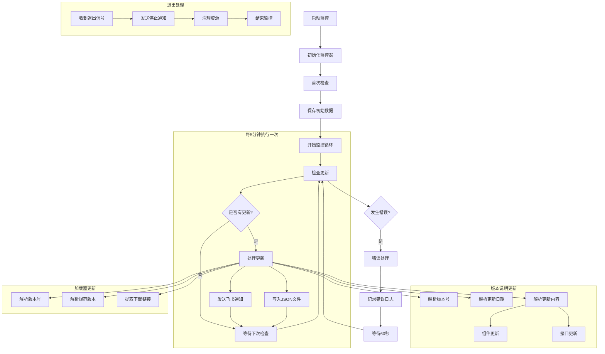

# Context
Created: [12:30:45]

## Original Prompt
需要将两个独立的Python监控脚本改造为Web服务并集成到现有项目中：
1. huaweiSM.py - 监控快应用版本说明更新（每5分钟检测一次）
2. huaweiJZQ.py - 监控快应用加载器更新（每5分钟检测一次）
这两个脚本目前通过飞书机器人通知变化。同时需要将整个项目迁移到服务器上。

## Project Overview
项目整体改造和迁移涉及：
1. 监控脚本改造
   - 保持原有Python脚本核心逻辑不变
   - 添加JSON文件输出功能
   - 定时运行并更新数据
2. 后端集成
   - 在现有Node.js后端添加新接口
   - 读取监控脚本生成的JSON文件
   - 提供监控数据的API
3. 前端开发
   - 在现有Vue项目中添加监控页面
   - 通过底部导航访问
   - 展示监控数据
4. 分阶段部署
   - 第一阶段：本地开发环境搭建和测试
   - 第二阶段：服务器环境准备和部署

## Issues and Progress Below
-----------------------------------
# ISSUE #1: 项目集成设计
-----------------------------------

## Analysis
1. 项目目录结构：
```
project/
├── frontend/          # 现有Vue前端
│   └── src/
│       ├── views/
│       │   └── monitor/    # 新增监控页面
│       └── components/
│           └── bottom-nav/ # 已修改的底部导航
│
├── backend/           # 现有Node.js后端
│   ├── routes/
│   │   └── monitor.js      # 新增监控相关路由
│   └── data/              # 监控数据存储
│       ├── version_updates.json
│       └── loader_updates.json
│
└── scripts/           # 监控脚本
    ├── huaweiSM.py   # 版本说明监控
    └── huaweiJZQ.py  # 加载器监控
```

2. 数据流转逻辑：
   - Python脚本定时运行并更新JSON文件
   - Node.js后端读取JSON文件并提供API
   - 前端通过API获取数据并展示

## Implementation
- [ ] 步骤0: 替换底部导航（优先级最高）
  - [ ] 0.1: 移除现有的5个底部导航图标
  - [ ] 0.2: 添加新的监控中心导航
  - [ ] 0.3: 验证点击跳转功能

- [ ] 步骤1: 本地开发环境准备
  - [ ] 1.1: 规范项目目录结构
    - [ ] 创建scripts目录
    - [ ] 创建data目录
    - [ ] 移动Python脚本到scripts目录
  - [ ] 1.2: 前端依赖安装
    - [ ] Element Plus
    - [ ] axios
    - [ ] echarts (可选，用于图表展示)

- [ ] 步骤2: 后端开发
  - [ ] 2.1: 添加监控相关路由
    - [ ] GET /api/monitor/version/latest
    - [ ] GET /api/monitor/version/history
    - [ ] GET /api/monitor/loader/latest
    - [ ] GET /api/monitor/loader/history
  - [ ] 2.2: 实现JSON文件读取功能
  - [ ] 2.3: 添加WebSocket支持(可选)
  - [ ] 2.4: 本地测试API接口

- [ ] 步骤3: 前端开发
  - [ ] 3.1: 创建Vue项目
  - [ ] 3.2: 实现监控组件
  - [ ] 3.3: 实现历史记录展示
  - [ ] 3.4: 集成WebSocket通知
  - [ ] 3.5: 添加错误处理和加载状态
  - [ ] 3.6: 本地调试前后端联调

- [ ] 步骤4: 本地部署测试
  - [ ] 4.1: 配置本地开发环境
  - [ ] 4.2: 启动后端服务
  - [ ] 4.3: 启动前端服务
  - [ ] 4.4: 完整功能测试
  - [ ] 4.5: 修复本地运行问题

- [ ] 步骤5: 服务器部署（完成本地测试后进行）
  - [ ] 5.1: 初始部署
    - [ ] 创建Git仓库并提交代码
    - [ ] 在服务器上克隆仓库
    - [ ] 安装Node.js环境
    - [ ] 安装Python环境和依赖
    - [ ] 配置环境变量
  
  - [ ] 5.2: 服务配置
    - [ ] 配置Nginx反向代理
    - [ ] 设置PM2守护Node.js进程
    - [ ] 配置Python脚本的定时任务（crontab）
    - [ ] 配置日志记录
  
  - [ ] 5.3: 启动服务
    - [ ] 启动Node.js后端（PM2）
    - [ ] 启动Python监控脚本
    - [ ] 验证服务状态
  
  - [ ] 5.4: 更新流程测试
    - [ ] 本地修改代码
    - [ ] 提交到Git
    - [ ] 服务器拉取更新
    - [ ] 重启服务
    - [ ] 验证更新

## 部署文档
1. 初始部署步骤：
```bash
# 1. 在服务器上克隆代码
git clone [仓库地址]
cd [项目目录]

# 2. 安装依赖
npm install
pip install -r requirements.txt

# 3. 配置PM2
pm2 start backend/app.js --name "monitor-backend"

# 4. 配置Python脚本守护进程
# 使用supervisor确保Python脚本持续运行
sudo apt-get install supervisor

# 创建supervisor配置文件
sudo vim /etc/supervisor/conf.d/huawei-monitor.conf

# 添加配置内容：
[program:huawei-sm]
command=python3 huaweiSM.py
directory=/path/to/scripts
autostart=true
autorestart=true
stderr_logfile=/var/log/huawei-sm.err.log
stdout_logfile=/var/log/huawei-sm.out.log

[program:huawei-jzq]
command=python3 huaweiJZQ.py
directory=/path/to/scripts
autostart=true
autorestart=true
stderr_logfile=/var/log/huawei-jzq.err.log
stdout_logfile=/var/log/huawei-jzq.out.log

# 更新supervisor
sudo supervisorctl reread
sudo supervisorctl update
```

2. 更新部署步骤（不中断服务）：
```bash
# 1. 登录服务器
ssh user@server

# 2. 进入项目目录
cd [项目目录]

# 3. 备份当前代码（以防需要回滚）
cp -r scripts scripts_backup

# 4. 拉取最新代码
git pull

# 5. 如果有依赖更新
npm install
pip install -r requirements.txt

# 6. 重启Node.js服务（使用PM2的reload避免停机）
pm2 reload monitor-backend

# 7. 重启Python监控脚本（一个一个更新，确保不会同时停止）
sudo supervisorctl restart huawei-sm
# 等待确认huawei-sm正常运行
sudo supervisorctl status huawei-sm
# 确认正常后再重启下一个
sudo supervisorctl restart huawei-jzq
```

3. 常用维护命令：
```bash
# 查看所有服务状态
sudo supervisorctl status
pm2 status

# 查看日志
sudo tail -f /var/log/huawei-sm.out.log
sudo tail -f /var/log/huawei-jzq.out.log
pm2 logs monitor-backend

# 如果需要回滚
cp -r scripts_backup/* scripts/
sudo supervisorctl restart huawei-sm huawei-jzq
```

4. 监控服务健康状态：
```bash
# 添加到crontab
* * * * * /path/to/check_services.sh

# check_services.sh 内容
#!/bin/bash
if ! pgrep -f "huaweiSM.py" > /dev/null; then
    sudo supervisorctl restart huawei-sm
fi
if ! pgrep -f "huaweiJZQ.py" > /dev/null; then
    sudo supervisorctl restart huawei-jzq
fi
```

## 监控流程图


### 流程说明
1. 监控初始化
   - 启动监控服务
   - 初始化监控器（配置URL和webhook）
   - 首次检查并保存初始数据
   - 发送启动通知

2. 监控循环（每5分钟）
   - 检查目标页面更新
   - 对比是否有变化
   - 如有更新则处理
   - 如无更新则等待下次检查

3. 数据处理
   - 版本说明更新：解析版本号、日期、更新内容
   - 加载器更新：解析版本号、规范版本、下载链接
   - 保存数据到JSON文件
   - 发送飞书通知

4. 异常处理
   - 捕获并记录错误
   - 等待60秒后重试
   - 保持服务持续运行

5. 退出处理
   - 接收退出信号
   - 发送停止通知
   - 清理资源
   - 优雅退出

## Status
- 当前状态：已完成项目集成方案设计
- 下一步：规范项目目录结构
- 阻塞项：无

## Implementation Steps
1. [x] 创建底部导航组件
   - [x] 使用 Vue 3 和 Element Plus 创建组件
   - [x] 添加监控中心入口
   - [x] 实现页面跳转功能
2. [x] 集成到主页面
   - [x] 引入组件
   - [x] 添加到页面布局
3. [ ] 本地开发环境搭建
   - [ ] 安装开发依赖
   - [ ] 配置开发环境
   - [ ] 初始化项目结构
4. [ ] 后端服务开发
   - [ ] 实现基础API
   - [ ] 添加WebSocket支持
   - [ ] 本地测试
5. [ ] 前端页面开发
   - [ ] 实现监控页面
   - [ ] 集成API调用
   - [ ] 本地调试
6. [ ] 本地部署测试
   - [ ] 完整功能测试
   - [ ] 问题修复
   - [ ] 性能优化

# Progress
[12:30:45] 开始任务：分析需求
[12:35:00] 完成：原有脚本分析
[12:45:00] 完成：接口设计
[13:00:00] 完成：前端设计
[13:10:00] 完成：整体方案设计
[13:30:00] 更新：调整任务优先级，优先处理底部导航替换
[13:45:00] 完成：创建底部导航组件并集成到主页面
[13:50:00] 更新：移除数据库相关内容，改用本地JSON存储
[14:00:00] 更新：调整为本地开发优先的任务计划